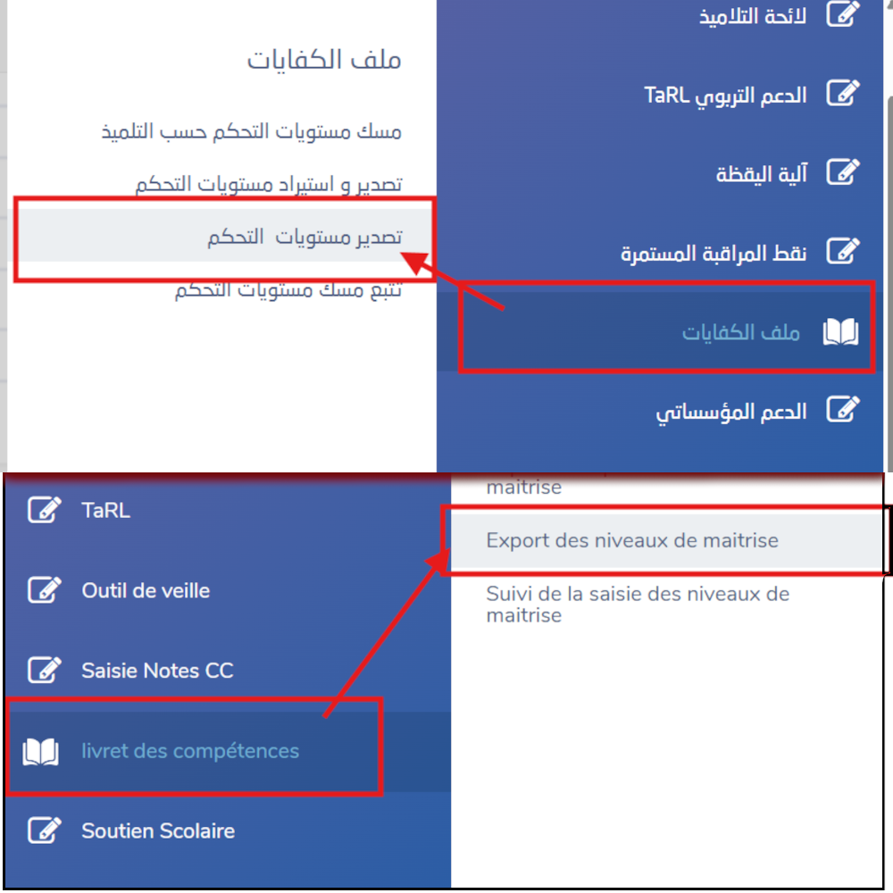

# 🎓 منظومة التتبع الدراسي الذكية (ProfAssistant) - لمساعدة الأساتذة في تدبير نقط التلاميذ وعرضها

[](https://opensource.org/licenses/MIT)
[](https://nodejs.org/)
[](#)

تطبيق ويب محلي ذكي، متطور، ومفتوح المصدر مصمم خصيصاً للأساتذة في المنظومة التعليمية المغربية لمساعدتهم في استيراد، تنظيم، وتدبير نقط التلاميذ المصدرة من منظومة **مسار (Massar)**. تم تصميم هذا التطبيق **خصيصاً وحصرياً لمدارس الريادة (المدارس الرائدة)** ليدعم بشكل كامل المواد الأساسية الثلاث: **اللغة العربية، اللغة الفرنسية، والرياضيات**. يتيح التطبيق عرض النتائج والبيانات بشكل تفاعلي، رسومي واحترافي، وتقديم تقارير دقيقة ومفصلة تفيد بشكل كبير في اللقاءات التفاعلية مع أولياء أمور التلاميذ.


---

## 🌟 المميزات الرئيسية

- **📊 لوحة تحكم تفاعلية**: مبيانات تفاعلية وذكية (باستخدام Chart.js) توضح تطور مستوى القسم الدراسي وتطور نقط ومعدلات كل تلميذ عبر 5 مراحل دراسية مختلفة.
- **📁 استيراد ذكي وفوري**: دعم كامل لخاصية سحب وإسقاط ملفات Excel (شبكات تفريغ النقط المصدرة من مسار) أو اختيار مجلد كامل يحتوي عليها؛ حيث يقوم النظام بمسحها برمجياً واستخراج البيانات تلقائياً.
- **📝 تقارير وتوصيفات تلقائية**: توليد تقرير وصفي وتقييم كيفي لمستوى التلميذ الدراسي ونقاط قوته وضعفه بناءً على نتائجه المحصل عليها وكفاياته.
- **⚡ فلترة ومبدل تفاعلي للمواد الثلاث**: إمكانية اختيار مادة واحدة أو مواد متعددة في آن واحد من المواد الثلاث الأساسية لمدارس الريادة (**اللغة العربية، اللغة الفرنسية، والرياضيات**) وتحديث الرسوم البيانية، والتقارير الكيفية، وجداول الكفايات فورياً لتعكس الاختيار.
- **🔍 بحث ذكي وسريع**: شريط بحث ديناميكي مزود بميزة الإكمال التلقائي الفوري للوصول إلى ملف أي تلميذ بكبسة زر وفي أجزاء من الثانية.
- **💾 حفظ ذكي لحالة التصفح**: يحفظ النظام حالتك الحالية (القسم المفتوح، التلميذ المحدد، التبويب النشط) في رابط الصفحة `location.hash` لتجنب ضياع السياق عند تحديث الصفحة.
- **🛡️ معالجة مرنة للملفات**: آلية ذكية للتعامل مع ملفات Windows وتفادي أخطاء الملفات المحجوزة (في حال كان ملف Excel مفتوحاً لدى الأستاذ في برنامج آخر)، مع إظهار تنبيهات بصرية واضحة غير معطلة للعمل.
- **📴 تشغيل كامل دون إنترنت**: يقوم التطبيق تلقائياً بتنزيل وحفظ جميع المكتبات والأيقونات محلياً ليتمكن الأستاذ من تشغيله داخل الفصول الدراسية والمناطق التي لا تتوفر على شبكة إنترنت.

---

## 🛠️ التقنيات المستخدمة

- **الواجهة الأمامية (Frontend)**: HTML5، CSS3 (تصميم عصري متجاوب بنظام Glassmorphism)، Vanilla ES6 JavaScript.
- **الخادم (Backend)**: Express.js (بيئة Node.js).
- **المكتبات الأساسية**:
  - `xlsx` (SheetJS) لقراءة ومعالجة ملفات Excel بسرعة فائقة.
  - `chart.js` لإنشاء المبيانات والرسوم البيانية المتميزة والمتجاوبة.
  - `fs-extra` للتعامل الاحترافي مع نظام الملفات والمجلدات.
  - `multer` لرفع وإدارة ملفات النقط.

---

## 🚀 دليل التشغيل السريع

### 1. المتطلبات الأساسية
تأكد من تثبيت بيئة **Node.js** (الإصدار 16 أو أعلى) على جهازك.
> **ملاحظة لمستخدمي Windows**: يدعم المشروع التشغيل المحمول عبر وضع ملف `node.exe` داخل المجلد `system/bin/`.

### 2. تثبيت المكتبات (للمرة الأولى فقط)
قم بجلب المشروع ثم ادخل إلى مجلد الخادم لتثبيت المكتبات اللازمة:
```bash
git clone https://github.com/youssef1817/ProfAssistant.git
cd ProfAssistant/system
npm install
```
*لمستخدمي نظام Windows:* في حال ظهور قيود صلاحيات تشغيل الأوامر (Execution Policy)، استخدم الأمر التالي:
```bash
npm.cmd install
```
أو قم بتفعيل الصلاحيات مؤقتاً عبر تشغيل PowerShell كمسؤول وكتابة:
```powershell
Set-ExecutionPolicy -ExecutionPolicy RemoteSigned -Scope CurrentUser
```

### 3. تشغيل النظام
لتشغيل الخادم المحلي، نفذ الأمر التالي داخل مجلد `system`:
```bash
node scripts/server.mjs
```
بعدها، افتح المتصفح وادخل إلى الرابط التالي:
👉 **[http://localhost:3000](http://localhost:3000)**

### 4. التشغيل بنقرة واحدة (على Windows)
يمكنك ببساطة النقر المزدوج على ملف `boot.bat` الموجود داخل مجلد `system` (أو اختصار `Lancer ProfAssistant` في المجلد الرئيسي)، وسيقوم تلقائياً بتشغيل خادم Node وفتح متصفح Google Chrome على واجهة التطبيق مباشرة.

---

## 📂 هيكلة البيانات وطريقة الاستيراد

1. انتقل إلى قسم **"استيراد البيانات"** من القائمة الجانبية للتطبيق.
2. قم بسحب وإسقاط **ملفات Excel الخاصة بمسار** أو اختر **مجلداً كاملاً** يحتوي على شبكات تفريغ النقط.
3. سيتعرف النظام تلقائياً على اسم المؤسسة، الموسم الدراسي، رقم المرحلة (1–5)، المواد، وأرقام مسار للتلاميذ.
4. اضغط على **"ابدأ عملية الاستيراد"** ليتم تنظيم وتخزين البيانات فوراً في ملف قاعدة البيانات المحلي `database.json`.

### 📥 نوع ملفات Excel المدعومة وكيفية تحميلها
الملفات المعنية هي شبكات تفريغ النقط التي يتم تصديرها من منظومة **مسار** عبر المسار التالي:
**ملف الكفايات** ← **تصدير مستويات التحكم**




---

## 🔒 حماية خصوصية بيانات التلاميذ

> [!IMPORTANT]
> **الخصوصية خط أحمر.** يتم تخزين جميع أسماء التلاميذ ونقطهم ومعدلاتهم **محلياً بالكامل** على حاسوبك الشخصي داخل ملف `system/database.json`. لا يتم إرسال أي معلومة أو بيان إلى أي خادم خارجي أو سحابة إلكترونية.
>
> يتضمن المشروع ملف `.gitignore` تم إعداده مسبقاً لاستبعاد الملفات الحساسة والتالية من الرفع إلى المستودع العام:
> - `system/database.json` (قاعدة البيانات المحلية المليئة بنقط تلاميذك)
> - `مستودع النقط/` (المجلد المحلي الذي تضع فيه ملفات Excel الحقيقية)
> - `system/uploads/` (ملفات الرفع المؤقتة)
> - `system/node_modules/` (حزم المكتبات البرمجية)
>
> وبذلك، يمكنك مشاركة وتطوير هذا المشروع البرمجي على حسابك في GitHub بكل أمان ودون أي قلق من تسريب بيانات تلاميذك الحقيقية.

---

## 🖥️ تطبيق الويندوز المستقل (Desktop App)

يدعم المشروع الآن بالكامل التحول إلى تطبيق ويندوز مكتبي مستقل واحترافي يعمل بضغطة زر وبدون الحاجة لفتح شاشات السيرفر أو استخدام المتصفح يدوياً!

### 📥 مميزات نسخة سطح المكتب:
- **تشغيل بضغطة زر**: نافذة تطبيق مستقلة وتفاعلية بالكامل تظهر بأيقونة التطبيق الرسمية في شريط المهام.
- **حفظ البيانات التلقائي**: يحفظ التطبيق قاعدة البيانات بشكل آمن ومحمي في مجلد مستخدم ويندوز (`AppData/Roaming/ProfAssistant`).
- **مجلد مستندات منظم**: يتم حفظ مجلد **مستودع النقط** بشكل تلقائي ومنظم داخل مجلد مستنداتك الشخصية: `Documents/ProfAssistant/مستودع النقط`.
- **نقل البيانات الذكي**: عند التشغيل لأول مرة، سيتعرف التطبيق تلقائياً على قاعدة بياناتك السابقة `system/database.json` وينقلها لمجلد التطبيق الآمن لضمان **عدم ضياع أي بيانات**!

### 🔨 كيفية بناء وتوليد التطبيق (.exe):
إذا أردت توليد ملف التثبيت الخاص بك بنفسك:
1. تأكد من دخولك لمجلد `system`:
   ```bash
   cd system
   ```
2. قم بتوليد النسخة المستقلة والنسخة المحمولة بأمر واحد:
   ```bash
   npm run dist
   ```
3. ستجد ملفات التطبيق التنفيذية جاهزة فوراً داخل مجلد مخرجات البناء `system/dist/`:
   - **`ProfAssistant Setup 1.0.0.exe`**: ملف تثبيت احترافي لويندوز مع اختصارات لسطح المكتب.
   - **`ProfAssistant 1.0.0.exe`**: نسخة محمولة (Portable) كاملة ومستقلة تعمل مباشرة بدون تثبيت (مثالية لوضعها على مفتاح USB وتشغيلها في أي حاسوب مدرسي!).

---

## 🤝 المساهمة في المشروع

نرحب بمساهمات جميع الأساتذة، المطورين والمصممين لتطوير هذا المشروع المجاني ومفتوح المصدر!
1. قم بعمل Fork للمشروع.
2. أنشئ فرعاً جديداً لميزتك المضافة (`git checkout -b feature/AmazingFeature`).
3. احفظ تعديلاتك (`git commit -m 'Add some AmazingFeature'`).
4. ارفع التعديلات للفرع (`git push origin feature/AmazingFeature`).
5. افتح طلب سحب (Pull Request).

---

## 📄 رخصة المشروع

المشروع مرخص تحت رخصة **MIT**. لمزيد من التفاصيل راجع ملف `LICENSE`.

---

**تم التطوير بكل ❤️ لدعم وتيسير عمل الأساتذة والأستاذات.**  
*معاً للارتقاء بمدارستنا بالاعتماد على الحلول الرقمية الذكية الحرة.*
